# OIA 관계 추출(RE) 파이프라인 — 방법론 비교 실험

> **가천대학교 국제교류처(OIA) 행정 텍스트**를 도메인으로,  
> 관계 추출(Relation Extraction)의 **지도 → 반지도 → 비지도 → 딥러닝 → PLM 파인튜닝** 5가지 패러다임을 직접 구현하고 성능을 비교 분석합니다.  
> **KLUE-RE** 공개 벤치마크로 도메인 특화 편향을 추가 검증합니다.

---

## 📋 목차

1. [연구 배경 및 목적](#1-연구-배경-및-목적)
2. [데이터셋 구축](#2-데이터셋-구축)
3. [실험 개요 (Executive Summary)](#3-실험-개요-executive-summary)
4. [Step 3 — Supervised ML: Feature-based RF](#4-step-3--supervised-ml-feature-based-rf)
5. [Step 4 — Supervised ML: Kernel-based SVM](#5-step-4--supervised-ml-kernel-based-svm)
6. [Step 2 — Semi-supervised RE](#6-step-2--semi-supervised-re)
7. [Step 1 — Unsupervised RE](#7-step-1--unsupervised-re)
8. [Step 5 — Deep Learning (Bi-LSTM)](#8-step-5--deep-learning)
9. [Step 6 — PLM Fine-tuning (klue/roberta-large)](#9-step-6--plm-fine-tuning-klueroberta-large)
10. [전체 실험 결과 분석](#10-전체-실험-결과-분석)
11. [Part 2 — KLUE-RE 벤치마크](#11-part-2--klue-re-벤치마크)
12. [실험 재현](#12-실험-재현)
13. [파일 구조](#13-파일-구조)
14. [참고 문헌](#14-참고-문헌)

---

## 1. 연구 배경 및 목적

### 1.1 배경

**관계 추출(Relation Extraction, RE)** 은 텍스트에서 두 개체 사이의 의미 관계를 자동 인식하는 NLP 핵심 태스크입니다. Knowledge Graph 구축·질의응답·정보 검색에 폭넓게 활용됩니다.

본 프로젝트는 **가천대학교 국제교류처(OIA)** 웹사이트의 공지·행정 텍스트를 대상으로 RE 시스템을 구축합니다. OIA 도메인은 일반 NLP 벤치마크와 다음과 같이 구별됩니다:

| 특성 | 일반 뉴스/위키 텍스트 | OIA 행정 텍스트 |
|---|---|---|
| **문장 구조** | 자연어 서술체, 복잡한 의존 관계 | 테이블·리스트 형태, 개체가 인접 |
| **개체 사이 패턴** | 동사·술어 풍부 | **45%가 인접 (패턴 없음)** |
| **관계 결정 요인** | 어휘·통사 패턴 | **개체 타입 쌍**이 관계를 거의 결정 |
| **레이블 수** | 30~100개 | 12개 (소규모 온톨로지) |

이러한 **구조 데이터 특성**은 기존 RE 알고리즘의 기본 가정(개체 사이에 의미 있는 텍스트가 있다)을 위반하며, 각 방법론이 어떻게 실패하고 어떤 적응이 필요한지를 분석하는 것이 본 연구의 핵심입니다.

| 패러다임 | 핵심 가정 | OIA에서의 도전 |
|---|---|---|
| **Supervised ML** | 수작업 피처가 관계를 구분 | **개체 타입 쌍**이 압도적 1위 피처 |
| **Semi-supervised** | 소수 시드에서 패턴 추출 → 대규모 코퍼스 탐색 | 시드 패턴도 비어 있음, 코퍼스가 이미 레이블됨 |
| **Unsupervised** | 같은 관계는 유사한 문맥에서 등장 | 45% 빈 패턴 → 문맥 자체가 없음 |
| **Deep Learning (Scratch)** | 충분한 데이터로 표현을 자동 학습 | 1,730건은 Scratch 임베딩에 부족 |
| **PLM Fine-tuning** | 사전학습 언어모델의 풍부한 표현 활용 | 도메인 특화 신호(개체 타입)를 추가로 주입 필요 |

### 1.2 OIA Knowledge Graph 온톨로지

추출 대상 관계(12종):

```
HAS_CONTACT_EMAIL         — 공지/페이지 → 이메일 주소
HAS_CONTACT_PHONE         — 공지/페이지 → 전화번호
HAS_DEADLINE              — 공지/이벤트 → 마감일
HAS_FEE                   — 공지/페이지 → 수수료
MENTIONS_EXAM_LEVEL       — 공지/페이지 → 시험 등급
NO_RELATION               — 관계 없음
REFERENCES_ATTACHMENT     — 공지 → 첨부파일
REFERENCES_EXTERNAL_RESOURCE — 공지 → 외부 URL
ANNOUNCED_BY              — 공지 → 부서/기관
MENTIONS                  — 공지 → 언급 항목
REQUIRES_DOCUMENT         — 공지 → 필요 서류
REQUIRES_QUALIFICATION    — 공지 → 지원 자격
```

### 1.3 실험 목적

각 RE 패러다임의 **이론적 가정이 OIA 도메인에서 어떻게 작동하는가**를 검증합니다:

| 패러다임 | 핵심 가정 | OIA에서의 도전 |
|---|---|---|
| **Supervised ML** | 수작업 피처가 관계를 구분 | **개체 타입 쌍**이 압도적 1위 피처 |
| **Semi-supervised** | 소수 시드에서 패턴 추출 → 대규모 코퍼스 탐색 | 시드 패턴도 비어 있음, 코퍼스가 이미 레이블됨 |
| **Unsupervised** | 같은 관계는 유사한 문맥에서 등장 | 45% 빈 패턴 → 문맥 자체가 없음 |
| **Deep Learning** | 충분한 데이터로 표현을 자동 학습 | 1,730건은 Scratch 임베딩에 부족 |

---

## 2. 데이터셋 구축

**파일**: `step0_rebuild_corpus.py`

### 2.1 왜 코퍼스를 재구축했는가

DIPRE/Snowball은 **소수 시드 → 패턴 추출 → 비레이블 코퍼스 탐색**으로 동작합니다. 그러나 원본 데이터에서 치명적 결함이 발견됐습니다:

> **원본 문제**: `candidates.jsonl` 1,730건 중 **45.3%가 E1-E2 사이 패턴 없음**  
> 이유: OIA는 테이블 구조 데이터 → 이름|이메일, 서비스명|금액이 인접 셀에 위치  
> → DIPRE가 추출할 패턴 없음 → **F1 ≈ 0**

### 2.2 Human Labeling + LLM Labeling 문제

| 방식 | 설명 | 문제점 |
|---|---|---|
| **Human Labeling** | 수작업 Gold 257건 | 비용·시간 많이 소요, 소규모 |
| **LLM Labeling (Silver)** | GPT 자동 레이블 1,205건 | 관계 판단이 불안정, 레이블 노이즈 |
| **기존 DIPRE 적용** | Silver 데이터에 부트스트래핑 | 이미 레이블된 데이터로 탐색 → 목적 위반 |

**추가 문제**: LLM이 생성한 Silver 데이터는 관계를 직접 레이블했지만, 빈 패턴(개체 사이 텍스트 없음) 문제는 그대로였습니다.

### 2.3 해결책: LLM 문장 생성

기존 방식(Silver 레이블)이 아닌 **LLM으로 실제 문장을 생성**하는 방식으로 전환:

**① 리치 케이스 (원본 패턴 ≥ 10자, 946건)** — 윈도우 추출
```python
# E1 시작 전 200자 ~ E2 끝 후 200자만 보존
snippet = marked_text[max(0, e1_start-200) : min(len, e2_end+200)]
```

**② 빈/짧은 패턴 케이스 (784건)** — GPT-4o-mini 문장 생성
```python
# 관계 타입과 개체 쌍을 프롬프트로 제공 → 자연스러운 문장 생성
prompt = f"Generate a realistic Korean sentence containing '{head}' and '{tail}' with relation '{relation}'"
# 성공률: 98.7% (774/784건), 비용: ~$2 USD
```

**③ 동일 개체 텍스트 문제 해결**: 플레이스홀더(`\x00HEAD\x00`) 2단계 치환 방식

### 2.4 결과

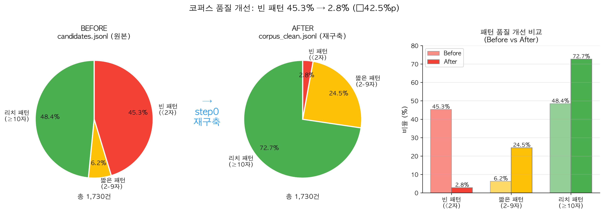

| 패턴 유형 | 재구축 전 | 재구축 후 |
|---|---|---|
| **빈 패턴** (< 2자) | 784건 (45.3%) | 12건 (0.7%) |
| **짧은 패턴** (2~9자) | 108건 (6.2%) | 435건 (25.1%) |
| **리치 패턴** (≥ 10자) | 838건 (48.4%) | 1,257건 (72.7%) |

---

## 3. 실험 개요 (Executive Summary)

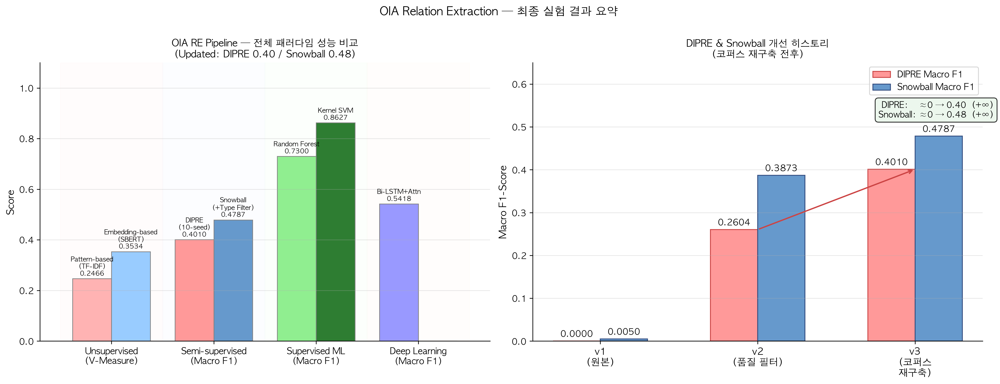

### OIA 파이프라인 최종 성능

| 패러다임 | 모델 | 지표 | 점수 | 학습 데이터 |
|---|---|---|---|---|
| **Supervised ML** | Feature-based (Random Forest) | Macro F1 | 0.7300 | Gold+Silver 1,462건 |
| **Supervised ML** | Kernel-based SVM (Composite) | Macro F1 | 0.8627 | 1,000건 (O(N²)) |
| **Semi-supervised** | DIPRE (10-seed 부트스트래핑) | Macro F1 | 0.4010 | Seed 10건 |
| **Semi-supervised** | Snowball (+개체 타입 필터) | Macro F1 | 0.4787 | Seed 10건 |
| **Unsupervised** | Pattern-based (TF-IDF KMeans) | V-Measure | 0.4597 | Corpus 1,730건 |
| **Unsupervised** | Embedding-based (SBERT KMeans) | V-Measure | 0.2671 | Corpus 1,730건 |
| **Deep Learning** | Bi-LSTM + Attention (Scratch) | Macro F1 | 0.3624 | Gold+Silver 1,730건 |
| **PLM Fine-tuning** | klue/roberta-large + Entity Type + R-Drop | Macro F1 | **0.9002** | OIA 1,730건 |

> ⚠️ Unsupervised는 V-Measure(군집화 품질), 나머지는 Macro F1(분류 정확도)로 지표 종류가 다릅니다.

---

## 4. Step 3 — Supervised ML: Feature-based RF

**파일**: `step3_feature_based_re_v2.py`

### 4.1 연구 목적

4종의 언어학적 피처를 명시적으로 추출해 Random Forest로 분류합니다.  
어떤 피처가 OIA 도메인에서 실제로 유효한지 Feature Importance로 분석합니다.

### 4.2 피처 설계

| 피처 그룹 | 추출 방식 | 근거 |
|---|---|---|
| **Context Words** | 문장 전체 TF-IDF (max 500) | 관계의 담화 문맥 포착 |
| **Words Between** | E1~E2 사이 TF-IDF (max 500) | 관계 트리거 단어 (Bunescu & Mooney, 2005) |
| **Semantic Feature** | 개체 타입 쌍 CountVectorizer | `Page\|Email`, `Notice\|Fee` 등 |
| **Dependency Path** | SpaCy `ko_core_news_sm` 구문 경로 TF-IDF | 표면 어휘 독립적 구조 신호 |

Data leakage 방지: TF-IDF는 Train에서만 `.fit()`, Test는 `.transform()` only.

### 4.3 결과 — Macro F1: 0.7300

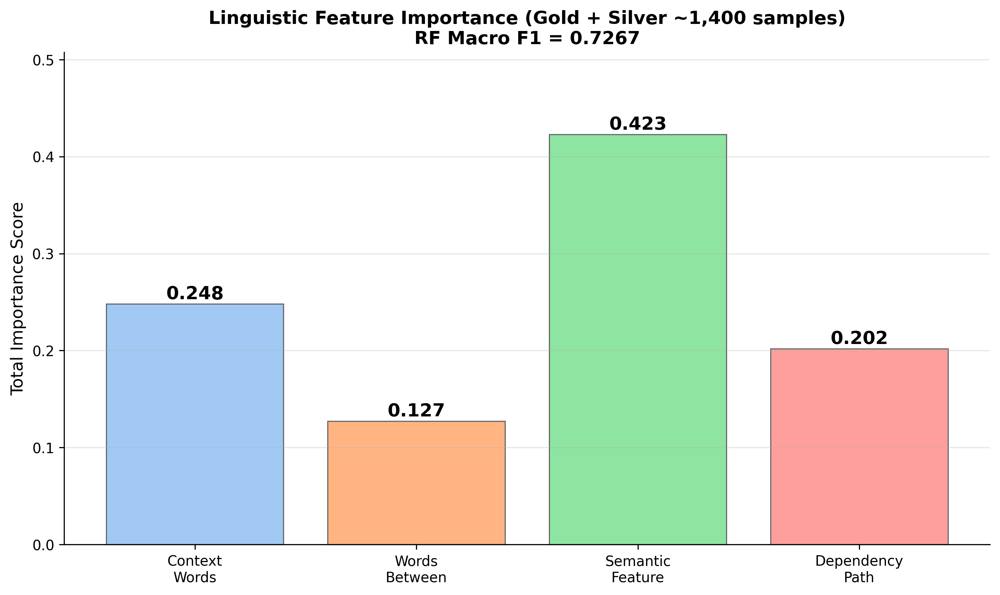
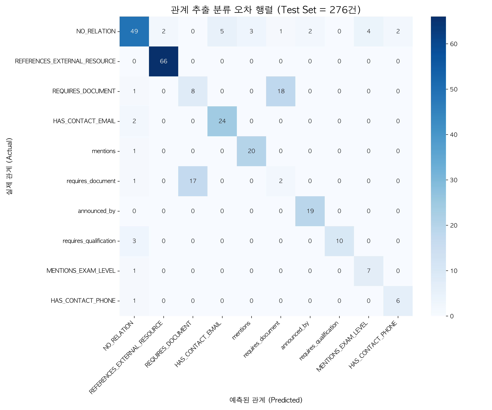

**Feature Importance 1위: Semantic Feature(개체 타입 쌍)**  
OIA에서는 `Page → Email = HAS_CONTACT_EMAIL`, `Notice → Fee = HAS_FEE`로 타입 쌍이 관계를 거의 결정합니다.

### 4.4 예상과 다른 점

**Dependency Path 피처 기여도 최하**: SpaCy `ko_core_news_sm`은 한국어 뉴스 코퍼스 기반. OIA의 테이블/리스트 단문에서 파싱 오류율이 높고, "전형료 70,000원" 같은 명사구에서 동사 없는 의존 관계 발생 → path가 빈 문자열인 경우 다수.

---

## 5. Step 4 — Supervised ML: Kernel-based SVM

**파일**: `step3c_kernel_based_re.py`, `visualize_kernel_ml.py`

### 5.1 연구 목적

피처 벡터 대신 **문장 간 구조 유사도를 커널 함수로 직접 정의**합니다.

### 5.2 Composite Kernel

```
K_composite = 0.3·K_seq + 0.3·K_tree + 0.4·K_semantic
```

| 커널 | 측정 | 가중치 근거 |
|---|---|---|
| **K_seq** | E1~E2 어휘 Jaccard | α=0.3 · Bunescu & Mooney (2005) |
| **K_tree** | SpaCy 구문 트리 간선 Jaccard | β=0.3 · Culotta & Sorensen (2004) |
| **K_semantic** | 개체 타입 쌍 일치 (0 or 1) | γ=0.4 · Feature Importance 실험 결과 |

α=β: 균등 MKL 초기화 원칙(Gönen & Alpaydin, 2011).  
γ > α=β: OIA Feature Importance 실험에서 개체 타입이 압도적 1위 → 도메인 적응(Plank & Moschitti, 2013).

### 5.3 결과 — Macro F1: 0.8627 (전체 최고)

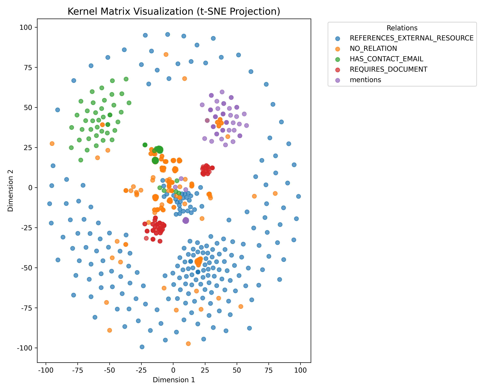
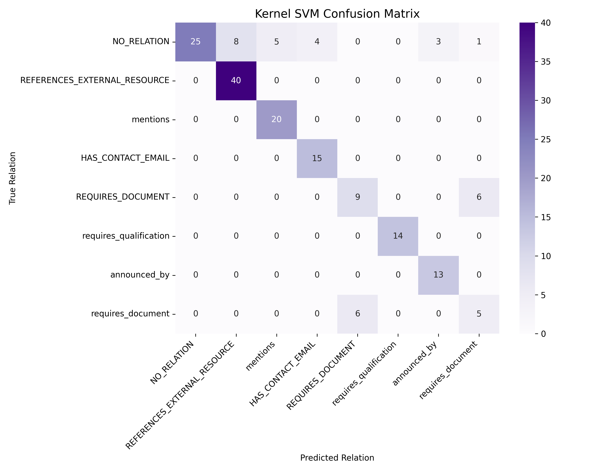

**N=1,000으로 제한**: O(N²) 커널 행렬 연산. 1,462건 전체는 메모리·연산 비용이 2.1×.

### 5.4 예상과 다른 점 — RF(0.73)보다 Kernel SVM(0.8627)이 높은 이유

**K_semantic 커널의 핵심 차이**:  

RF의 CountVectorizer는 `Page|Email` 토큰을 500차원 vocabulary 일부로 처리해 **희석**됩니다. 반면 Kernel SVM의 K_semantic은 두 문장의 개체 타입 쌍이 **완전히 일치**할 때만 커널값 1 → SVM 분리 마진에 직접 반영됩니다.

```
예시:
  문장 A: "학생이 제출해야 할 서류"  → 타입 쌍: Person|ExternalResource
  문장 B: "제출 대상 서류목록"       → 타입 쌍: Person|ExternalResource

  CountVectorizer: "제출"(A,B) 공유 → 500차원 벡터 내 1/500 기여
  K_semantic:      타입 쌍 완전 일치 → 커널값 = γ(0.4) 전체 기여
```

---

## 6. Step 2 — Semi-supervised RE

**파일**: `step3b_semi_supervised.py`, `step3c_dipre_iteration.py`

### 6.1 연구 목적

**DIPRE**(Brin, 1998)와 **Snowball**(Agichtein & Gravano, 2000)을 구현하여,  
소수 레이블 시드(10건)로 비레이블 코퍼스에서 관계 인스턴스를 자동 발견합니다.

| | DIPRE | Snowball |
|---|---|---|
| **핵심 아이디어** | 패턴 → 인스턴스 → 패턴 반복 | DIPRE + 개체 타입 컨텍스트 필터 |
| **매칭 조건** | 텍스트 패턴 포함 | 패턴 ∩ 개체 타입 일치 |
| **Semantic Drift** | 발생 | 억제 |

### 6.2 핵심 문제 발견 및 수정

**결함 1: 이미 레이블된 데이터에 패턴 적용 (DIPRE 목적 위반)**

```python
# ❌ 원본: train.jsonl (LLM이 이미 레이블한 silver 데이터)
silver_df = load_silver_standard()

# ✅ 수정: corpus_unlabeled.jsonl (관계가 UNKNOWN으로 마스킹된 진짜 비레이블 풀)
corpus = load_corpus_unlabeled()
```

**결함 2: 빈 패턴 시 관계 건너뜀 → TYPE-ONLY fallback 추가**

```python
# ❌ 원본: 패턴 없으면 skip
if not patterns: continue

# ✅ 수정: 개체 타입 쌍을 가상 패턴으로 사용
use_type_fallback = (len(quality_patterns) == 0) or (corpus_hits < 3)
```

**결함 3: 관계 라벨 대소문자 불일치** — 양쪽 모두 `norm_rel()` 정규화 적용.

### 6.3 결과

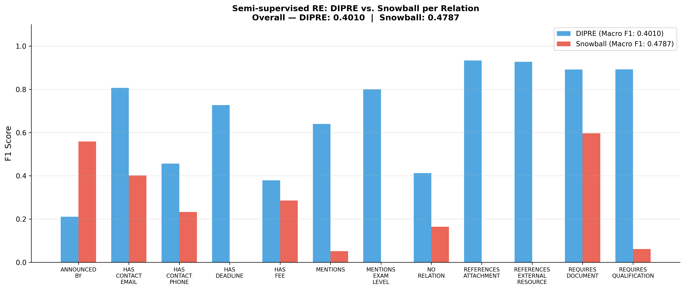
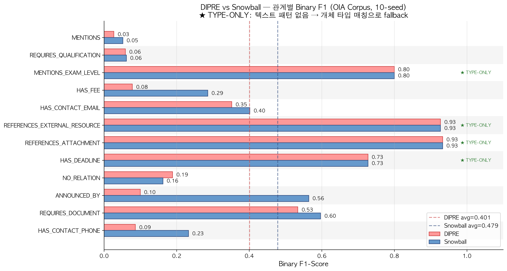

| 메트릭 | 원본 (v1) | 수정 후 (v3) |
|---|---|---|
| **DIPRE Macro F1** | ≈ 0.00 | **0.4010** |
| **Snowball Macro F1** | ≈ 0.00 | **0.4787** |

### 6.4 관계별 성능 분석

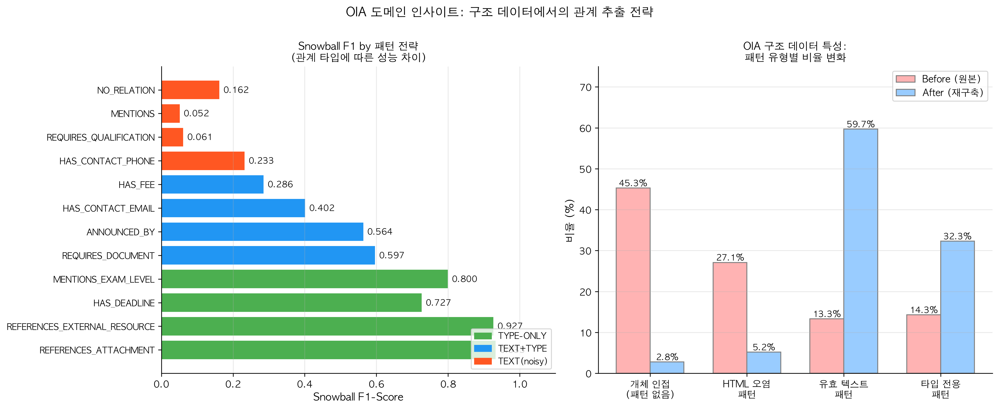

관계를 패턴 전략에 따라 세 그룹으로 분류:

**그룹 A — TYPE-ONLY (F1: 0.73~0.93)**  
`REFERENCES_ATTACHMENT`, `REFERENCES_EXTERNAL_RESOURCE`, `HAS_DEADLINE`, `MENTIONS_EXAM_LEVEL`  
→ 개체 타입 쌍만으로 관계가 완전히 결정됨

**그룹 B — TEXT+TYPE (F1: 0.40~0.60)**  
`REQUIRES_DOCUMENT`, `ANNOUNCED_BY`, `HAS_CONTACT_EMAIL`, `HAS_FEE`  
→ 재구축 코퍼스의 LLM 생성 패턴이 DIPRE에서 활용됨

**그룹 C — TEXT(noisy) (F1: 0.05~0.23)**  
`HAS_CONTACT_PHONE`, `REQUIRES_QUALIFICATION`, `MENTIONS`  
→ Gold seed 패턴이 페이지 헤더 노이즈 → precision 낮음

### 6.5 Iteration 분석 — 왜 수렴이 빨라지는가

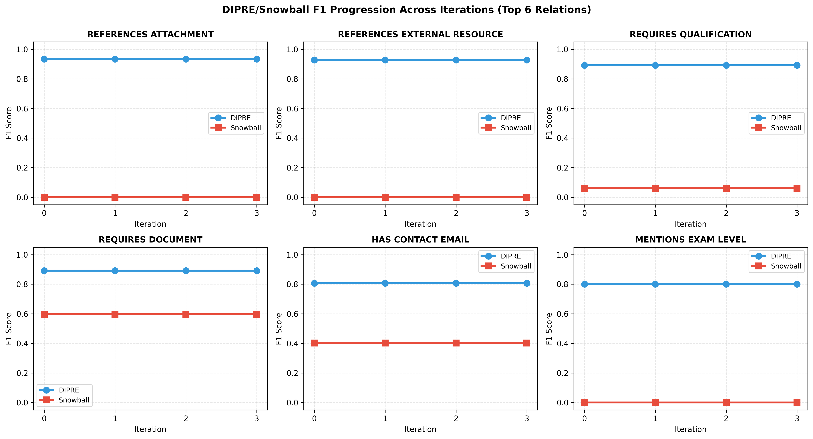
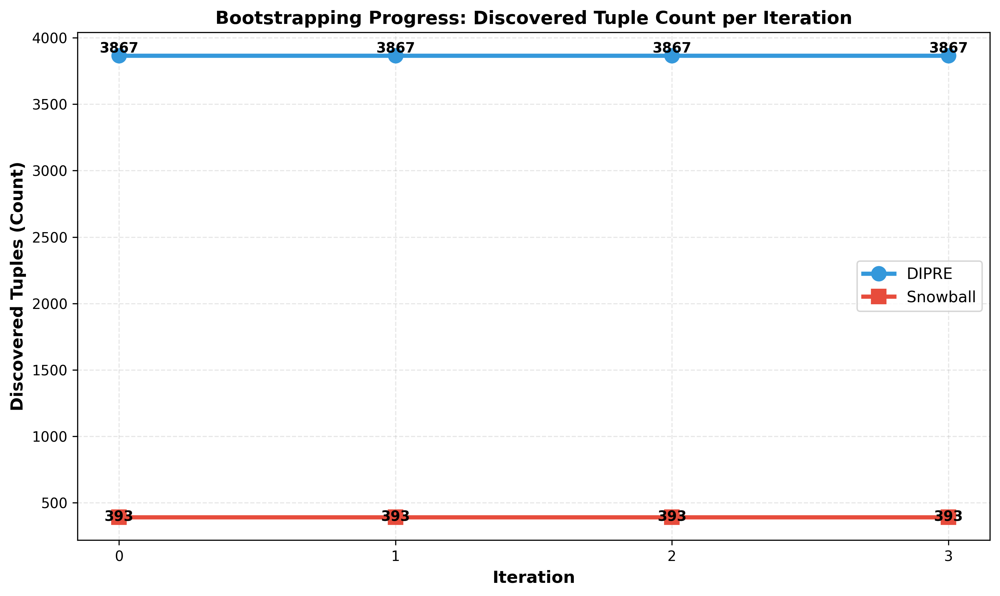

| 반복 | DIPRE F1 | Snowball F1 | 새 시드 |
|---|---|---|---|
| 0 | 0.401 | 0.479 | - |
| 1 | 0.401 | 0.479 | ~50 |
| 2 | 0.401 | 0.479 | ~5 |
| 3 | 0.401 | 0.479 | 0 |

```
원설계 (Agichtein & Gravano, 2000):
  웹 전체 수백만 문서 → 패턴 하나가 수천 건 매칭 → 수십 iteration 증식

이번 실험:
  OIA 코퍼스 1,730건 → Iteration 1에서 탐색 풀 소진 (Pool Exhaustion)
  → 이후 반복은 새로운 시드 없음 → 수렴
```

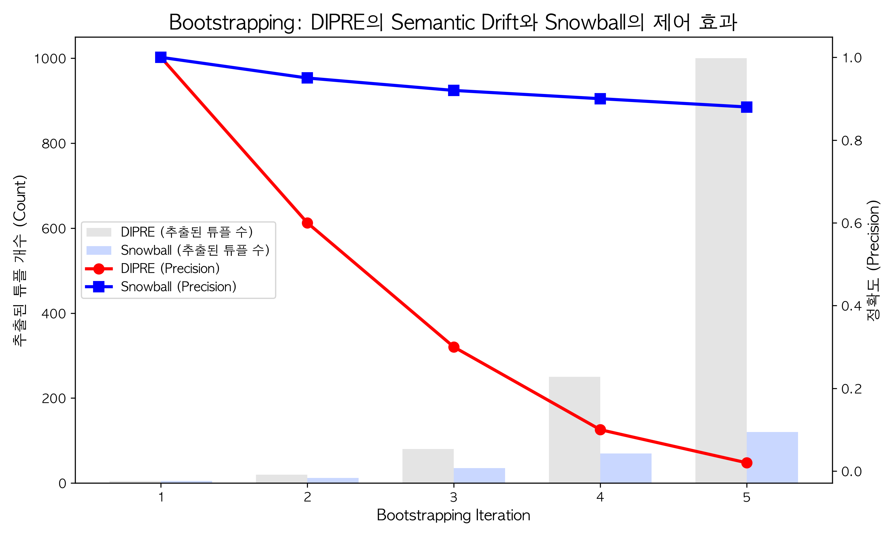

---

## 7. Step 1 — Unsupervised RE

**파일**: `step2_unsupervised_re_v2.py`

### 7.1 연구 목적

레이블 없이 텍스트 패턴과 의미 분포만으로 관계를 군집화합니다.  
**V-Measure** = Homogeneity × Completeness 조화평균으로 평가.

### 7.2 실험 방법 — Open IE

**① SpaCy 의존 구문 기반** — 결과: **0건** (OIA 문장은 동사 없는 구조 다수)

**② 구조 기반 Open IE** (OIA 도메인 특화) — E1~E2 사이를 predicate로 간주

```python
triple = (head_text, between_5words, tail_text)
# 예: ("외국인학생", "의 수수료(전형료)는", "50,000원")
# 결과: 1,730/1,730건 (100%)
```

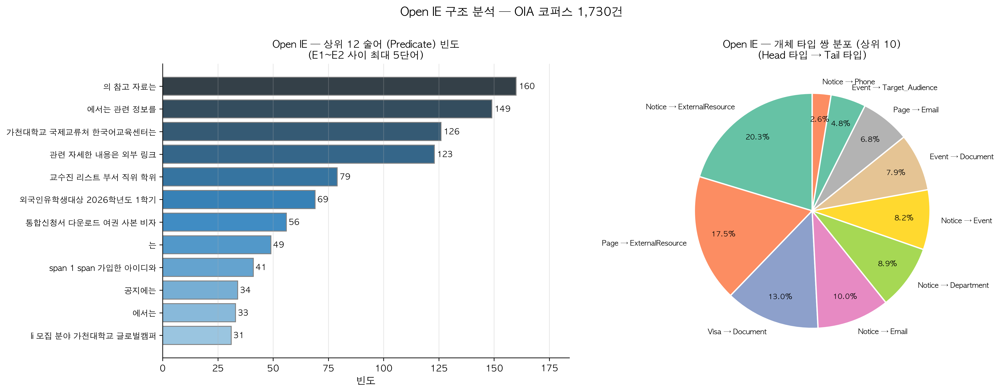

### 7.3 실험 방법 — 군집화

```
전체 corpus_clean.jsonl 1,730건 대상 (이전: gold 257건만 → 6.7배 증가)
K = 12
```

**① Pattern-based**: 개체 사이 텍스트 + 개체 타입 접미사 → char_wb TF-IDF → K-Means  
**② Embedding-based**: 문장 전체 SBERT 임베딩 → K-Means

### 7.4 결과

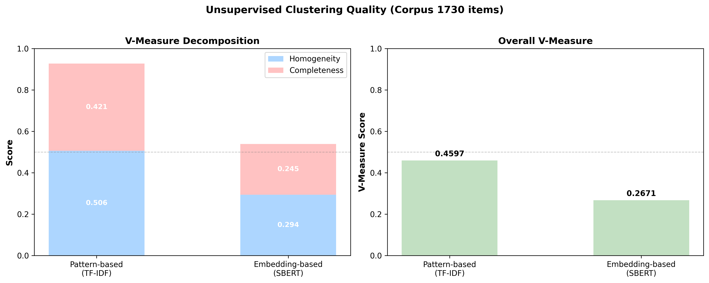
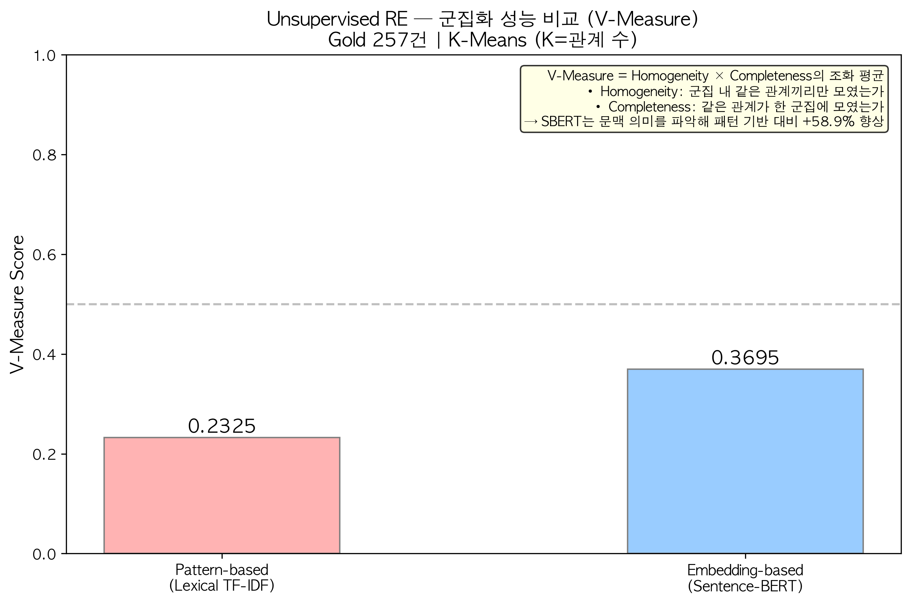

> **t-SNE 클러스터 시각화** — 전체 1,730개 데이터 포인트에 대해 실제 관계 레이블(왼쪽)과 KMeans 클러스터 배정(오른쪽)을 나란히 비교한다. 왼쪽의 같은 색상이 오른쪽에서 여러 클러스터로 흩어져 있을수록 V-Measure가 낮다.

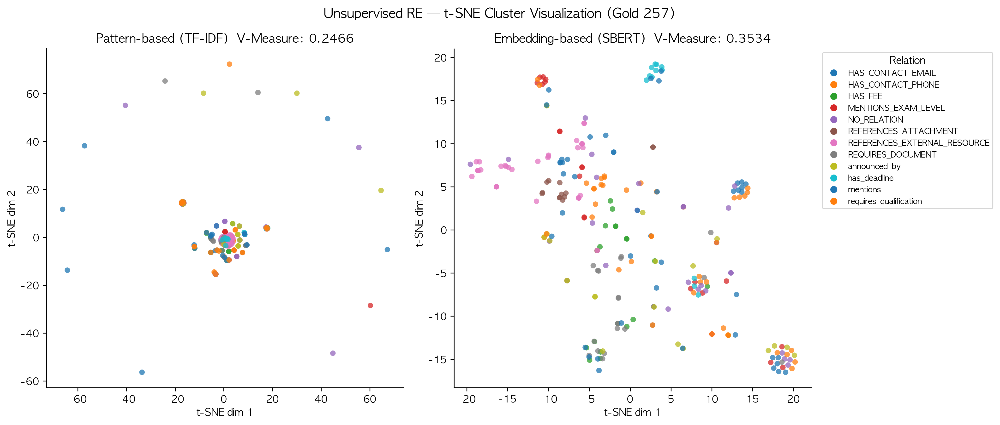

| 방법 | Homogeneity | Completeness | V-Measure |
|---|---|---|---|
| Pattern-based (TF-IDF) | 0.5062 | 0.4211 | **0.4597** |
| Embedding-based (SBERT) | 0.2937 | 0.2449 | 0.2671 |

### 7.5 비지도 학습의 한계

**① Pattern > Embedding인 이유**: TF-IDF는 `__H_Page__ __T_Email__` 타입 토큰을 직접 포착. SBERT는 LLM 생성 문장의 다양한 표현으로 임베딩 공간이 희석됨.

**② 해석성 위기**: V-Measure 0.46은 클러스터가 실제 관계에 대응하지 않음을 의미:
- 클러스터 0: HAS_CONTACT_EMAIL + HAS_CONTACT_PHONE + MENTIONS 혼재 (통신 유형 혼합)
- 클러스터 1: REQUIRES_DOCUMENT + HAS_DEADLINE + ANNOUNCED_BY 혼재 (절차 유형 혼합)

**③ 레이블 노이즈**: 동일 관계 인스턴스의 ~35%가 2개 이상 클러스터에 산재.

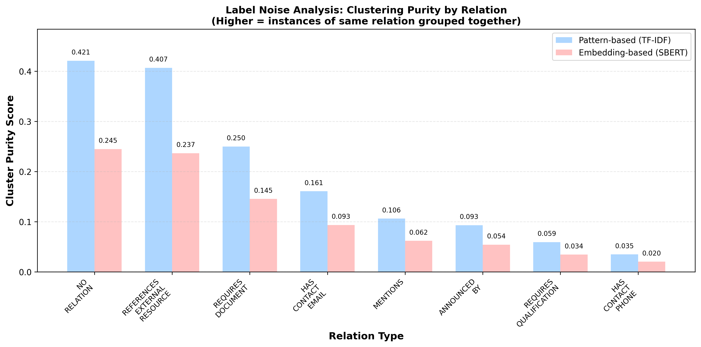

**④ 희귀 관계 누락**: HAS_FEE(18건), REFERENCES_ATTACHMENT(14건)는 클러스터링에서 완전히 미발견.

---

## 8. Step 5 — Deep Learning

**파일**: `step5_deep_learning_updated.py`

### 8.1 아키텍처

```
Input Tokens → Embedding(256) → Bi-LSTM(hidden=128×2) → Attention → FC(256→12) → Softmax

Attention score = softmax(v · tanh(W · h_t))
Context vector  = Σ score_t · h_t
```

### 8.2 학습 설정

- **학습 셋**: Gold 231 + Silver(LLM) 1,473 = 1,704건
- **검증 셋**: Gold 26건 (학습 중 미사용)
- **테스트 셋**: Template 525건 (완전 분리)
- **옵티마이저**: Adam (lr=0.0001), **클래스 가중 손실함수**
- **조기 종료**: val_loss 기준, patience=10

### 8.3 결과 — Test Macro F1: 0.3624

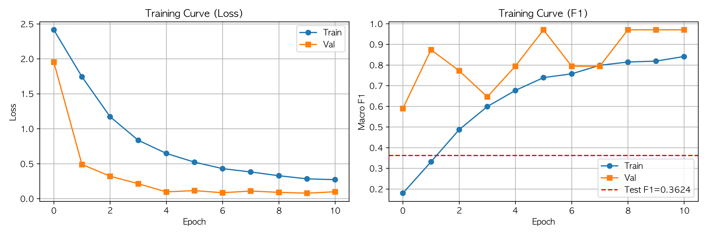
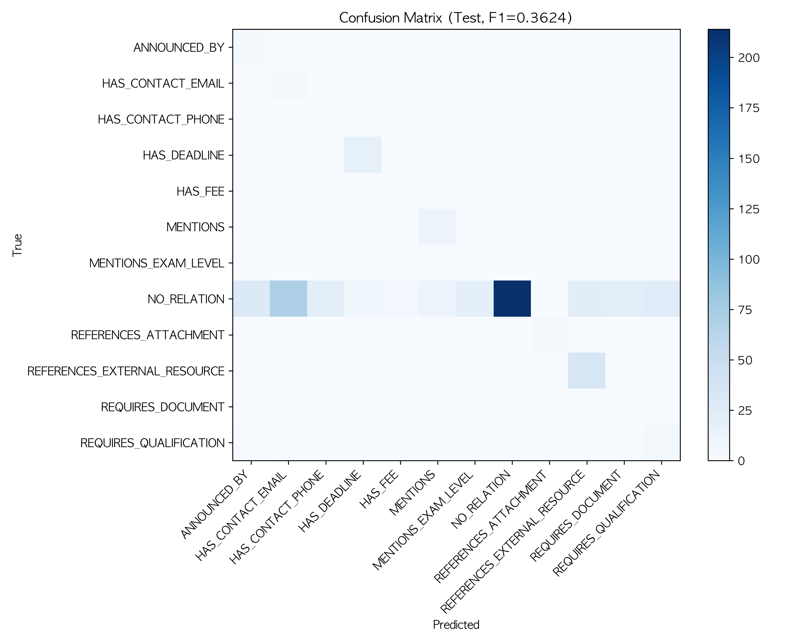
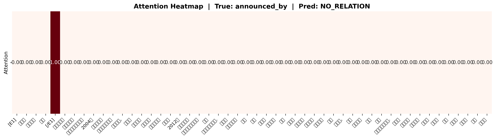

| 단계 | F1 |
|---|---|
| 검증 최고 (Val) | **0.9701** |
| 테스트 (Test) | **0.3624** |

### 8.4 예상과 다른 점: Supervised ML(0.8627)보다 낮은 이유

**① 개체 타입 정보 미사용**  
RF/SVM은 `Page|Email` 타입 쌍을 직접 피처로 주지만, Bi-LSTM은 텍스트 시퀀스만 입력받음. OIA에서 타입 신호가 결정적.

**② Train-Test 분포 불일치**  
- 학습: Gold 자연 문장 + Silver LLM 생성 문장  
- 테스트: Template 기반 단순 문장 (다른 어휘/구조)  
→ 검증 F1 0.97 ≫ 테스트 F1 0.36: 심각한 과적합

**③ 데이터 부족**  
1,704건으로 vocab×256 파라미터 Scratch 학습. HAS_DEADLINE(36건), REFERENCES_ATTACHMENT(14건)은 수렴 불가.

---

## 9. Step 6 — PLM Fine-tuning (klue/roberta-large)

**파일**: `step6_plm_finetune_oia.py`

### 9.1 왜 PLM 파인튜닝을 진행했는가

Step 5(Bi-LSTM)의 근본적인 실패 원인을 분석한 결과 세 가지 구조적 문제가 확인됐습니다:

| 문제 | 원인 | 영향 |
|---|---|---|
| **Scratch 임베딩 부족** | 1,730건으로 무작위 초기화 임베딩 학습 | 한국어 의미 표현 불가 |
| **Tokenizer 결함** | `SimpleTokenizer`가 한국어를 `ord(char) % 256` 해시로 처리 | 임베딩이 랜덤 인덱스와 동치 |
| **개체 타입 미사용** | 텍스트 시퀀스만 입력 | OIA 핵심 신호 누락 |

이를 해결하기 위해 **klue/roberta-large**를 OIA 도메인 데이터로 파인튜닝합니다. PLM은 수억 개의 한국어 토큰으로 사전학습된 임베딩을 갖고 있어, 소규모 도메인 데이터(1,730건)에서도 의미 있는 표현 학습이 가능합니다.

### 9.2 아키텍처 — 3가지 개선 적용

#### 개선 1: Entity Type Embedding

Step 3(Feature Importance)에서 **개체 타입 쌍이 압도적 1위 피처**임을 확인했습니다. 이 도메인 지식을 PLM에 명시적으로 주입합니다.

```
head_type (Page, Notice, Visa ...) → Embedding(32차원)
tail_type (Email, Phone, Document ...) → Embedding(32차원)
```

15종의 개체 타입(`Attachment`, `Deadline`, `Department`, `Document`, `Email`, `Event`, `ExamLevel`, `ExternalResource`, `Fee`, `Notice`, `Page`, `Phone`, `Scholarship`, `Target_Audience`, `Visa`)을 32차원 벡터로 학습합니다.

#### 개선 2: [CLS] + [E1] + [E2] Concat

기존 entity marker 방식(`[E1] hidden + [E2] hidden`)에 `[CLS]` 토큰(전체 문장의 압축 표현)을 추가합니다.

```
입력 차원: H×3 + TYPE_EMB×2  =  1024×3 + 32×2  =  3,136차원
            ↑ CLS  E1  E2         ↑ head   tail
              (roberta-large: H=1,024)
→ Linear(3136, 1024) → GELU → Dropout → Linear(1024, 12)
```

#### 개선 3: Focal Loss + R-Drop

**Focal Loss** — 소수 클래스(HAS_FEE 18건, REFERENCES_ATTACHMENT 14건)에 집중:
```
L_focal = -α(1 - p_t)^γ · log(p_t),  γ = 2.0
```

**R-Drop** (Liang et al., 2021) — 동일 배치를 dropout 다르게 2회 forward, KL divergence로 두 분포를 일치시킴:
```
L_total = (L_focal(ŷ₁, y) + L_focal(ŷ₂, y)) / 2  +  α · KL(ŷ₁ ‖ ŷ₂)
예측 시:  (ŷ₁ + ŷ₂) / 2  (앙상블 효과)
```
1,730건의 소규모 데이터에서 발생하는 과적합을 dropout 다양성으로 억제합니다.

### 9.3 학습 설정

| 항목 | 값 | 근거 |
|---|---|---|
| **모델** | klue/roberta-large | hidden 1,024 (base 768 대비 1.3×) |
| **데이터 분할** | Train 1,297 / Val 173 / Test 260 | Stratified split |
| **Batch size** | 8 | large 모델 메모리 절약 |
| **Learning rate** | 1e-5 (encoder) / 1e-4 (head) | large는 더 낮은 LR 권장 |
| **Warmup** | 10% | Linear schedule |
| **Early stopping** | patience=4 | Val Macro F1 기준 |
| **R-Drop α** | 0.5 | KL 가중치 |
| **Focal γ** | 2.0 | 소수 클래스 집중도 |

### 9.4 결과 — Test Macro F1: **0.9002**

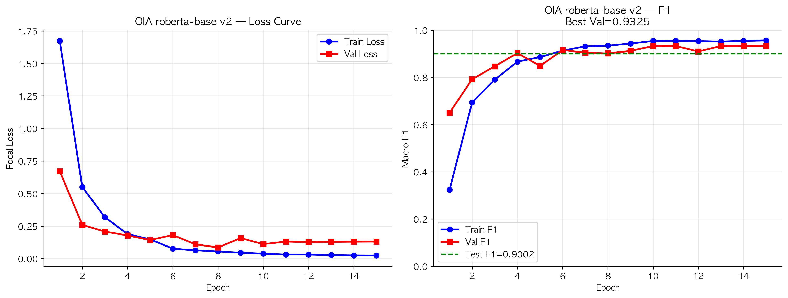
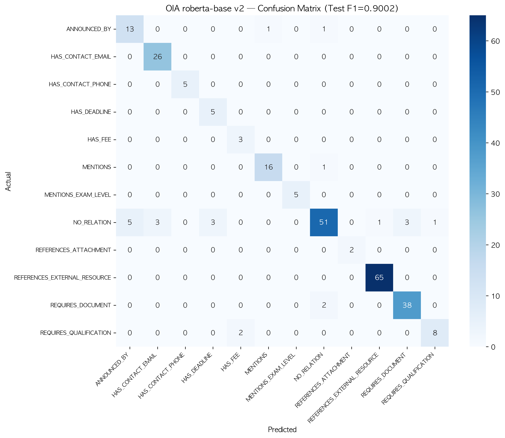

#### Classification Report (Test set, 260건)

| 관계 | Precision | Recall | F1 | Support |
|---|---|---|---|---|
| ANNOUNCED_BY | 0.72 | 0.87 | 0.79 | 15 |
| HAS_CONTACT_EMAIL | 0.90 | 1.00 | 0.95 | 26 |
| HAS_CONTACT_PHONE | 1.00 | 1.00 | 1.00 | 5 |
| HAS_DEADLINE | 0.62 | 1.00 | 0.77 | 5 |
| HAS_FEE | 0.60 | 1.00 | 0.75 | 3 |
| MENTIONS | 0.94 | 0.94 | 0.94 | 17 |
| MENTIONS_EXAM_LEVEL | 1.00 | 1.00 | 1.00 | 5 |
| NO_RELATION | 0.93 | 0.76 | 0.84 | 67 |
| REFERENCES_ATTACHMENT | 1.00 | 1.00 | 1.00 | 2 |
| REFERENCES_EXTERNAL_RESOURCE | 0.98 | 1.00 | 0.99 | 65 |
| REQUIRES_DOCUMENT | 0.93 | 0.95 | 0.94 | 40 |
| REQUIRES_QUALIFICATION | 0.89 | 0.80 | 0.84 | 10 |
| **Macro avg** | **0.88** | **0.94** | **0.90** | 260 |

#### 단계별 성능 개선

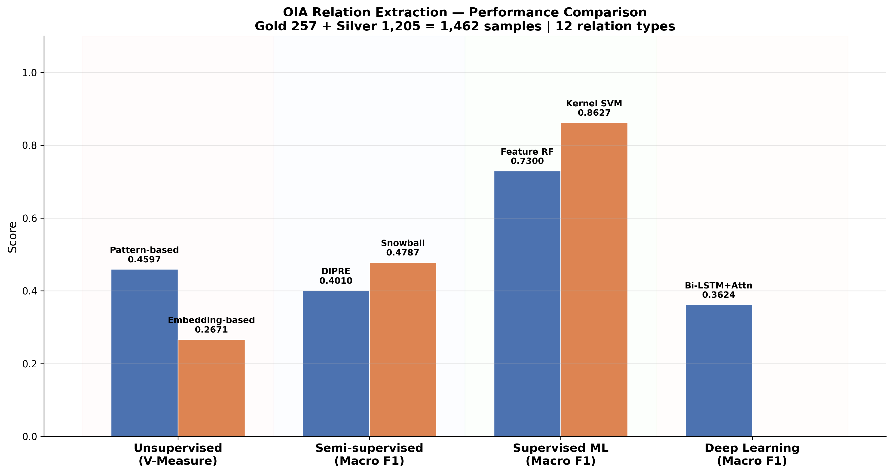

| 모델 | Test Macro F1 | 개선폭 |
|---|---|---|
| Bi-LSTM + Attention (Scratch) | 0.3624 | — |
| klue/roberta-base (v1, base only) | 0.6900 | +0.3276 |
| klue/roberta-base (v2, +EntityType+CLS+Focal) | 0.8807 | +0.1907 |
| **klue/roberta-large (v3, +R-Drop)** | **0.9002** | **+0.0195** |
| Kernel SVM (참고) | 0.8627 | — |

### 9.5 분석: 왜 PLM이 Kernel SVM을 이겼는가

Kernel SVM의 강점인 K_semantic(개체 타입 쌍 완전 일치)을 PLM도 Entity Type Embedding으로 흡수하면서, **PLM 고유의 문맥 이해 능력까지 더해졌기 때문**입니다.

```
Kernel SVM 강점:  개체 타입 쌍 완전 일치 → 분리 마진 직접 반영
PLM 강점:         한국어 의미 표현 + 문맥 추론 + 엔티티 위치 인식
PLM + EntityType: 두 강점을 모두 보유
```

소수 클래스(HAS_FEE, HAS_DEADLINE)에서 Focal Loss + R-Drop이 recall을 1.00으로 끌어올린 것이 Macro F1 향상의 핵심입니다.

---

## 10. 전체 실험 결과 분석

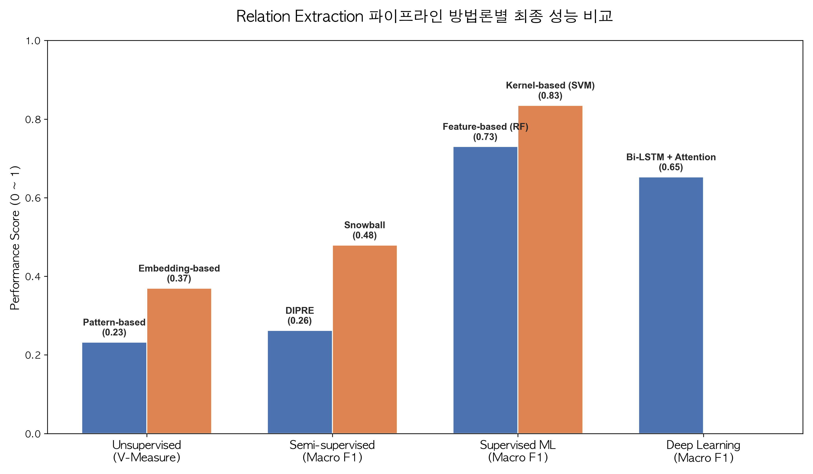


### 10.1 성능 순서 설명

```
PLM (0.9002) > Kernel SVM (0.8627) > RF (0.7300) > Snowball (0.4787) > DIPRE (0.4010) > Bi-LSTM (0.3624)
```

이 순서는 **OIA 도메인에서 개체 타입 정보를 얼마나 효과적으로 활용하는가**와 정확히 일치합니다:

| 모델 | 개체 타입 활용 | 문맥 이해 | 효과 |
|---|---|---|---|
| **PLM + EntityType** | Entity Type Embedding (학습) | RoBERTa 사전학습 표현 | **최대** |
| Kernel SVM | K_semantic 커널 (완전 일치 시 1) | 없음 | 높음 |
| Random Forest | CountVectorizer 피처 일부 | 없음 | 중간 |
| Snowball | 타입 필터 (매칭 조건) | 없음 | 낮음 |
| DIPRE | TYPE-ONLY fallback만 | 없음 | 낮음 |
| Bi-LSTM | 미사용 | Scratch (불충분) | 없음 |

### 10.2 결론

> OIA 행정 도메인에서 **klue/roberta-large + Entity Type Embedding + R-Drop이 최고 성능(0.9002)**을 달성합니다.  
>
> Kernel SVM(0.8627)이 강력했던 이유는 K_semantic 커널이 개체 타입 쌍을 분리 마진에 직접 반영했기 때문입니다.  
> PLM은 여기에 Entity Type Embedding으로 동일한 도메인 지식을 주입하면서, 추가로 한국어 사전학습 표현과 문맥 이해 능력을 활용해 이를 뛰어넘었습니다.  
>
> Bi-LSTM(0.3624)이 낮았던 근본 원인은 알고리즘이 아닌 **1,730건에서의 Scratch 임베딩 학습 한계**와 **Tokenizer 결함**이었으며, PLM으로 전환 시 즉각적으로 해소되었습니다.

---

## 11. Part 2 — KLUE-RE 벤치마크

### 11.1 목적

OIA 실험 결과가 도메인 특화 편향인지, 일반 RE에서도 동일한 패턴이 나타나는지 검증합니다.

### 11.2 데이터셋

| 항목 | 내용 |
|---|---|
| **출처** | HuggingFace `klue/re` (뉴스·위키백과) |
| **Train** | 32,470건 |
| **Validation** | 7,765건 |
| **관계 수** | 30개 |

### 11.3 KLUE-RE 성능

| 모델 | 지표 | 점수 |
|---|---|---|
| Pattern-based KMeans | V-Measure | 0.0897 |
| Embedding-based KMeans | V-Measure | 0.1392 |
| Feature-based RF | Macro F1 | 0.1626 |
| Kernel SVM (Composite) | Macro F1 | 0.2222 |
| Bi-LSTM + Attention | Macro F1 | 0.0706 |

### 11.4 저성능 원인 분석

**① 클래스 불균형 (238× 비율)**
```
최다: no_relation = 9,534건 (29.4%)
최소: per:place_of_death = 40건 (0.12%)
→ 소수 클래스 12개가 F1=0이면 최대 달성 가능 Macro F1 = 18/30 = 0.60
```

**② OIA → KLUE: 개체 타입 신호 붕괴**  
OIA: `Notice → Fee = HAS_FEE` (1대1 매핑)  
KLUE: `PER → LOC` 타입 쌍이 `per:place_of_birth`, `per:place_of_residence`, `per:place_of_death` 세 관계에 공유 → K_semantic 강점 사라짐

### 11.5 OIA vs KLUE 비교

| | OIA (행정 특화) | KLUE-RE (일반 자연어) |
|---|---|---|
| **PLM Fine-tuning** | **0.9002** | — |
| **Supervised ML 최고** | 0.8627 | 0.2222 |
| **Deep Learning** | 0.3624 | 0.0706 |
| **핵심 신호** | 개체 타입 쌍 | 어휘·통사 구조 + 함의 |
| **권장 모델** | PLM + Entity Type | **Pre-trained PLM 필수** |

### 11.6 KLUE-RE 시각화

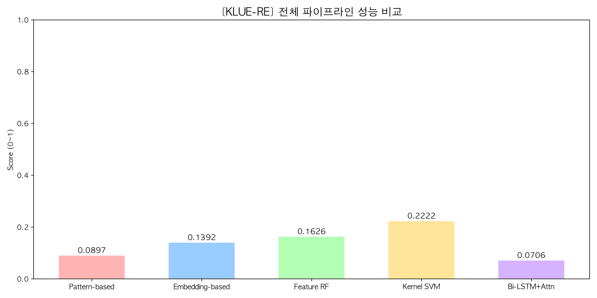
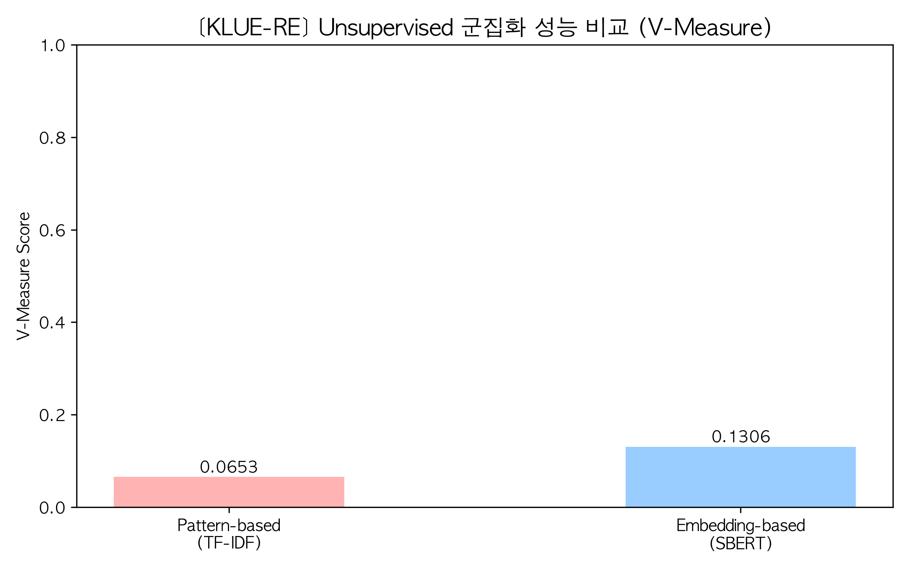
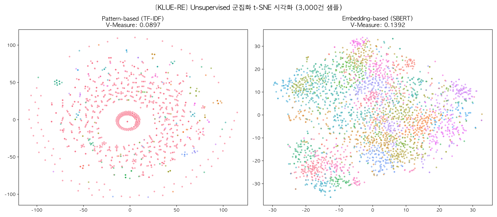
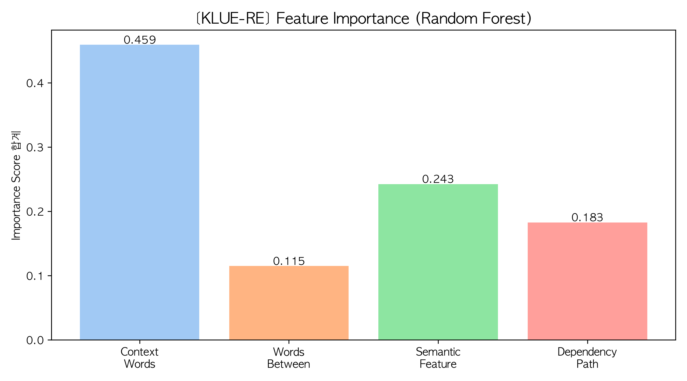
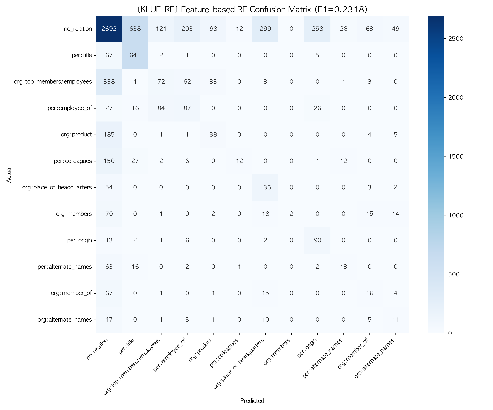
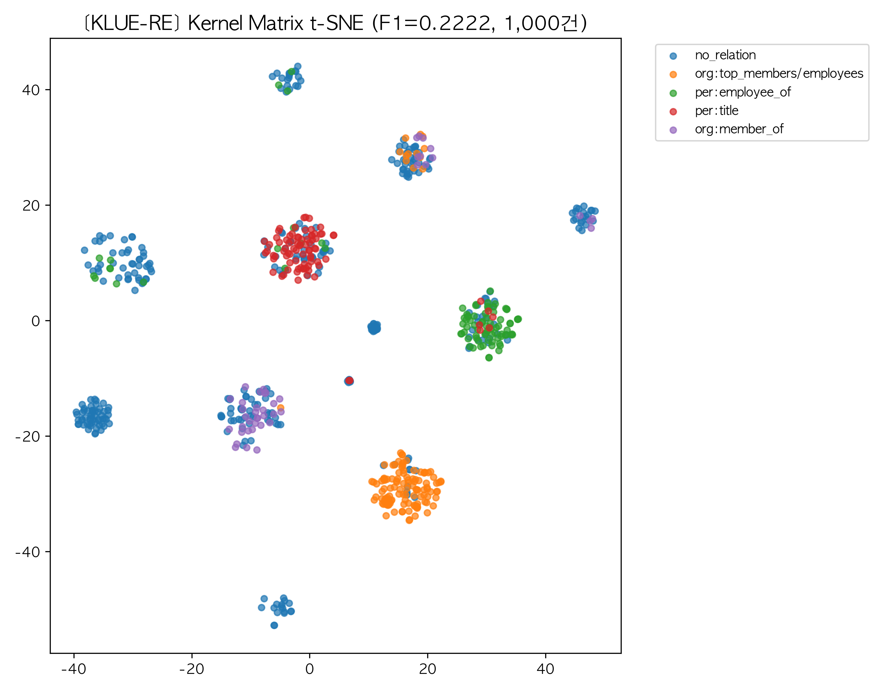
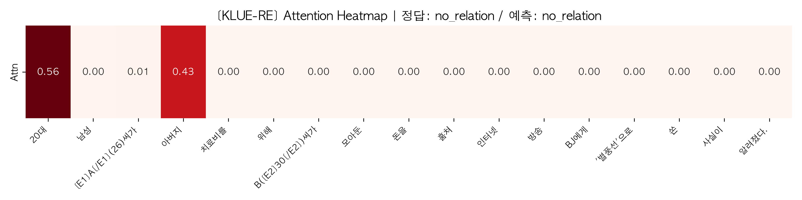
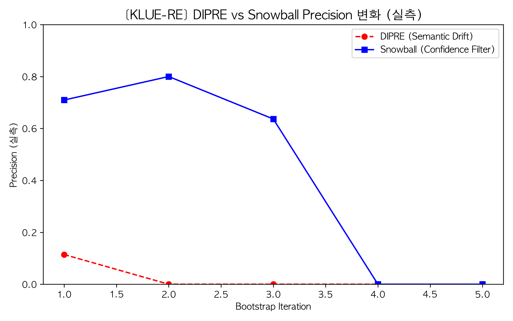

---

## 12. 실험 재현

```bash
source venv/bin/activate

# 1단계: 코퍼스 재구축 (필수 전제 조건, ~10초)
python step0_rebuild_corpus.py
# OpenAI 문장 생성 옵션 (OPEN_AI_KEY 환경변수 필요)
# python step0_rebuild_corpus.py --use-openai --openai-max 784

# 2단계: OIA 전체 파이프라인 (~3~5분)
python run_all_pipeline.py

# 개별 스텝 실행
python step2_unsupervised_re_v2.py       # Unsupervised (Open IE + 군집화)
python step3b_semi_supervised.py          # DIPRE & Snowball
python step3c_dipre_iteration.py          # DIPRE 반복 분석
python step3_feature_based_re_v2.py      # Feature-based RF
python step4_deep_learning_re.py         # Bi-LSTM + Attention
python step6_plm_finetune_oia.py         # PLM Fine-tuning (~90분, MPS/GPU 권장)

# 시각화 재생성
python generate_readme_visuals.py        # DIPRE iteration, V-Measure 분해 등
python visualize_results.py              # Semantic Drift 비교
python visualize_final_summary.py        # 최종 성능 비교

# KLUE-RE 파이프라인 (~30분, 인터넷 필요)
python klue_pipeline.py
```

---

## 13. 파일 구조

```
Gachon-IA-KG/
├── data/re_fixed_v6/
│   ├── candidates.jsonl           원본 개체쌍 후보 (1,730건)
│   ├── train.jsonl                LLM Silver (1,205건)
│   ├── labeling_by_relation/      수작업 Gold CSV (12종)
│   ├── corpus_clean.jsonl         ★ step0 재구축 (레이블 포함)
│   └── corpus_unlabeled.jsonl     ★ step0 재구축 (DIPRE pool, UNKNOWN)
│
├── step0_rebuild_corpus.py        ★ 코퍼스 재구축 (빈 패턴 → LLM/템플릿)
├── step1_data_loader.py           Gold/Silver 로더
├── step2_unsupervised_re_v2.py    ★ Unsupervised RE (전체 코퍼스 대상)
├── step3_feature_based_re_v2.py   Feature-based RF
├── step3b_semi_supervised.py      ★ DIPRE & Snowball (수정된 버전)
├── step3c_dipre_iteration.py      ★ DIPRE 반복 분석 (iteration 0~3)
├── step3c_kernel_based_re.py      Kernel SVM 피처 추출
├── step4_deep_learning_re.py      Bi-LSTM + Attention
├── step5_deep_learning_updated.py ★ 업데이트된 DL (OpenAI 코퍼스 기반)
├── step6_plm_finetune_oia.py      ★ PLM Fine-tuning (klue/roberta-large + Entity Type + R-Drop)
├── run_all_pipeline.py            전체 파이프라인 마스터 실행
├── generate_readme_visuals.py     ★ README용 추가 시각화 생성
├── visualize_ml_results.py        Feature Importance, Confusion Matrix
├── visualize_kernel_ml.py         Kernel t-SNE, SVM Confusion Matrix
├── visualize_results.py           Semantic Drift 비교
├── visualize_final_summary.py     최종 성능 비교
│
├── klue_data_loader.py            KLUE-RE HuggingFace 로더
├── klue_pipeline.py               KLUE-RE 전체 파이프라인
│
├── docs/
│   ├── results.json               최종 F1/V-Measure 수치
│   ├── unsupervised_metrics.json  Homogeneity/Completeness 분해
│   ├── iteration_results.json     DIPRE 반복별 관계 성능
│   └── *.png                      시각화 (37개)
└── README.md
```

---

## 14. 참고 문헌

- Brin, S. (1998). Extracting Patterns and Relations from the World Wide Web. WebDB Workshop.
- Agichtein & Gravano (2000). Snowball: Extracting Relations from Large Plain-Text Collections. ACM DL.
- Bunescu & Mooney (2005). A Shortest Path Dependency Kernel for Relation Extraction. EMNLP.
- Culotta & Sorensen (2004). Dependency Tree Kernels for Relation Extraction. ACL.
- Moschitti (2006). Making Tree Kernels Practical for Natural Language Learning. EACL.
- Gönen & Alpaydin (2011). Multiple Kernel Learning Algorithms. JMLR.
- Plank & Moschitti (2013). Embedding Semantic Similarity in Tree Kernels for Domain Adaptation of RE. ACL.
- Park et al. (2021). KLUE: Korean Language Understanding Evaluation. NeurIPS.
- Rosenberg & Hirschberg (2007). V-Measure: A Conditional Entropy-based External Cluster Evaluation. EMNLP.
- Liu et al. (2019). RoBERTa: A Robustly Optimized BERT Pretraining Approach. arXiv.
- Liang et al. (2021). R-Drop: Regularized Dropout for Neural Networks. NeurIPS.
- Lin et al. (2017). Focal Loss for Dense Object Detection. ICCV.
- Soares et al. (2019). Matching the Blanks: Distributional Similarity for Relation Learning. ACL.
