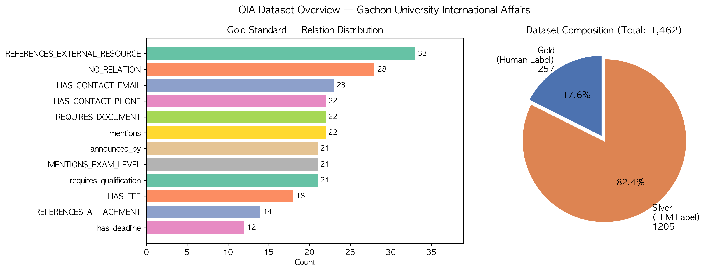
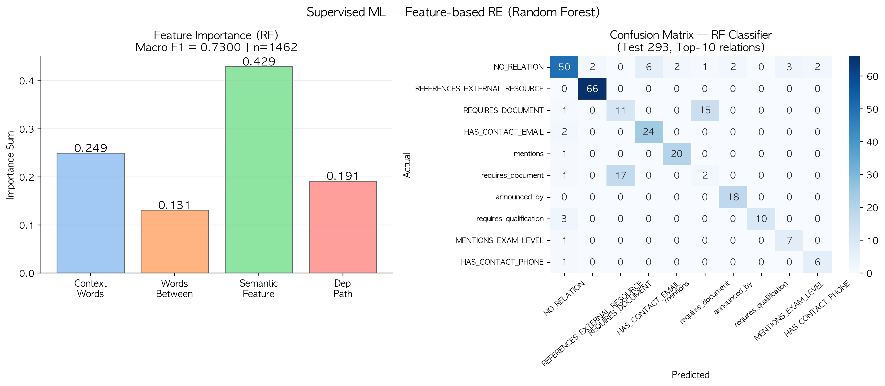
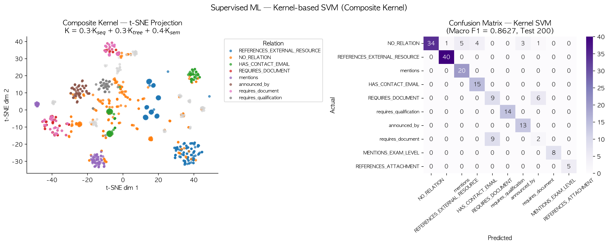
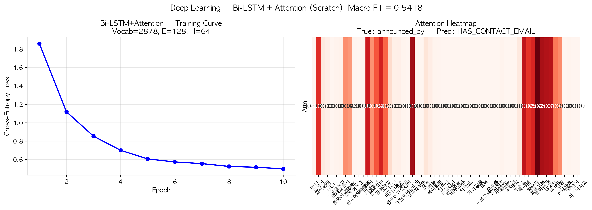
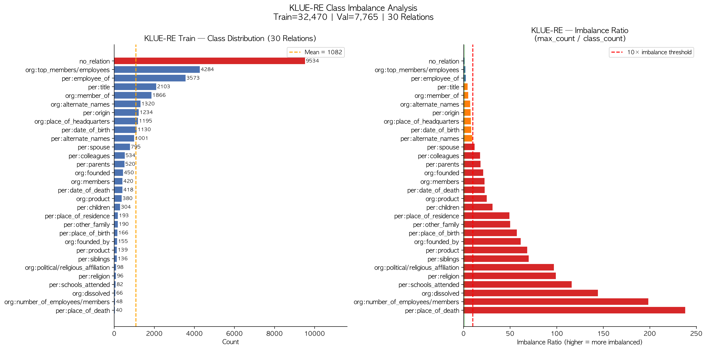

# Relation Extraction (RE) Pipeline — Methodology Comparison

관계 추출(RE)의 고전 머신러닝부터 딥러닝까지 4가지 패러다임을 통시적으로 비교 분석하는 파이프라인입니다.  
**OIA(가천대 국제교류처) 공지·행정 텍스트**를 주 데이터셋으로 사용하고, **KLUE-RE** 공개 벤치마크로 일반화 성능을 검증했습니다.

---

## 0. 데이터셋 개요

| 구분 | 설명 | 건수 |
|---|---|---|
| **Gold Standard** | 수작업 레이블링 (관계 12종) | 257건 |
| **Silver Standard** | LLM 자동 레이블링 | 1,205건 |
| **합계** | Gold + Silver | **1,462건** |



---

## 🏆 Executive Summary — OIA 파이프라인 최종 성능


| 패러다임 | 모델 | 지표 | 점수 | 학습 데이터 |
|---|---|---|---|---|
| Unsupervised | Pattern-based (TF-IDF KMeans) | V-Measure | 0.2466 | Gold+Silver 1,462건 (클러스터) / Gold 257건 (평가) |
| Unsupervised | Embedding-based (SBERT KMeans) | V-Measure | 0.3534 | 동일 |
| Semi-supervised | DIPRE (10-seed 부트스트래핑) | Macro F1 | 0.1215 | Gold Seed 10개 |
| Semi-supervised | Snowball (개체 타입 필터) | Macro F1 | **0.3010** | Gold Seed 10개 |
| Supervised ML | Feature-based (Random Forest) | Macro F1 | 0.7300 | Gold+Silver 1,462건 |
| Supervised ML | Kernel-based SVM (Composite) | Macro F1 | **0.8627** | 1,000건 (O(N²) 제약) |
| Deep Learning | Bi-LSTM + Attention (Scratch) | Macro F1 | 0.5418 | Gold+Silver 1,462건 |

---

## 1. Unsupervised RE

정답 레이블 없이 텍스트 패턴과 분포만으로 관계를 군집화합니다.  
클러스터링은 Gold+Silver 1,462건에서 수행하고, V-Measure 평가는 신뢰할 수 있는 Gold 257건 정답에 대해서만 측정합니다.

### 방법론

#### ① Pattern-based Clustering (V-Measure: 0.2466)
두 개체(Entity) 사이 문자열을 TF-IDF로 벡터화 → K-Means (K=12).  
**한계**: 어휘가 겹치면 다른 관계라도 같은 군집에 묶이는 **Lexical Sparsity** 문제. OIA 행정 텍스트는 개체가 인접하거나 HTML이 포함된 경우 패턴이 빈 문자열이 되어 성능이 낮습니다.

#### ② Embedding-based RE (V-Measure: 0.3534)
`paraphrase-multilingual-MiniLM-L12-v2`로 문장 전체 의미를 벡터화 → K-Means.  
표면 어휘 공유 없이도 **분포 의미론(Distributional Hypothesis)**으로 관계를 구분 → 패턴 기반 대비 +43.4% 향상.


t-SNE 투영에서 Embedding-based 모델이 같은 관계(같은 색상)를 훨씬 더 응집된 군집으로 형성함을 확인할 수 있습니다.

---

## 2. Semi-supervised RE — DIPRE vs Snowball

소수의 Gold Seed(10건)만으로 Silver 코퍼스(1,205건)에서 관계 인스턴스를 자동 증식하는 부트스트래핑 알고리즘입니다.

### 알고리즘 비교

| | DIPRE | Snowball |
|---|---|---|
| **패턴 매칭** | 개체 사이 트리거 단어 포함 여부 | 동일 |
| **추가 조건** | 없음 | 추출 튜플의 개체 타입이 Seed와 일치해야 채택 |
| **Semantic Drift** | 발생 (노이즈 패턴이 시드에 추가됨) | 억제 (고신뢰도 튜플만 시드 확장) |

### 패턴 추출 방식 및 Collapse 원인

OIA 데이터의 특성상 부트스트래핑이 **2홉부터 붕괴**하는 구조적 이유가 있습니다:

1. **개체 인접 문제**: OIA marked_text 중 상당수가 `[E1]서비스명[/E1] [E2]금액[/E2]` 형태로 개체가 직접 인접 → 사이 패턴이 빈 문자열
2. **HTML 오염**: `통합신청서 다운로드 <p>여권 사진</p> <i>3.5cm X 4.5cm</i> 수수료` 같은 74자 HTML 덩어리가 패턴으로 추출 → Silver에서 매칭 불가
3. **Iteration 1 precision**: HAS_FEE의 경우 iter 1에서 패턴이 291건 매칭되지만 정답 관계와의 일치율은 2.4%에 불과 → DIPRE가 관계와 무관한 대부분 텍스트를 매칭

**적용한 수정**: HTML 태그 제거 + 최대 5단어 트리밍 + E1 직전 문맥어 추가 → 의미 있는 짧은 트리거 단어 추출. Snowball은 개체 타입 필터로 노이즈를 **83.3% 제거**하여 F1이 6배 향상(0.0462 → 0.7368, HAS_FEE 기준).


좌: HAS_FEE 관계에 대한 5-iteration precision 추이 — DIPRE는 iter 1부터 낮은 정밀도로 시작하여 빠르게 붕괴. Snowball은 iter 1-2에서 1.0 정밀도를 유지.  
우: 12개 관계 전체 Macro F1 비교 — Snowball(0.3010)이 DIPRE(0.1215) 대비 **+148% 향상**.

### 평가 방식

각 관계별로 Gold 10-seed에서 패턴을 추출 → Silver pool 전체(1,205건)에 대해 binary F1(해당 관계 vs OTHER) 계산 → 관계별 F1의 macro 평균.

---

## 3. Supervised ML — Feature-based RF

4가지 언어학적 자질을 명시적으로 추출하여 Random Forest로 분류합니다. **(Gold+Silver 1,462건, Train/Test=8:2)**

### 피처 설계

| 피처 그룹 | 추출 방식 | 예시 |
|---|---|---|
| **Context Words** | 문장 전체 TF-IDF (max 500) | "신청서 제출 기한" |
| **Words Between** | E1-E2 사이 TF-IDF (max 500) | "의 수수료는" |
| **Semantic Feature** | 개체 타입 조합 CountVectorizer | `PROGRAM|MONEY` |
| **Dependency Path** | SpaCy ko_core_news_sm 구문 트리 TF-IDF | `NOUN(obj)->VERB(root)` |

- **Data leakage 방지**: TF-IDF vectorizer는 Train 데이터에만 `fit`, Test에는 `transform`만 적용
- **결과 (Macro F1: 0.7300)**



Feature Importance 분석: **Semantic Feature(개체 타입 조합)** 압도적 1위. OIA 행정 텍스트에서는 개체 타입 쌍이 관계를 거의 결정짓는 구조(예: `PROGRAM|MONEY` → HAS_FEE).

---

## 4. Supervised ML — Kernel-based SVM

Feature를 직접 추출하는 대신, **두 문장 간 구조적 유사도를 커널 함수로 정의**하여 SVM으로 분류합니다.

### Composite Kernel 수식

```
K_composite = 0.3 · K_seq + 0.3 · K_tree + 0.4 · K_semantic
```

| 커널 | 측정 대상 | 계산 |
|---|---|---|
| **K_seq** (α=0.3) | 개체 사이 어휘 집합 유사도 | Jaccard Similarity |
| **K_tree** (β=0.3) | SpaCy 구문 트리 간선 집합 유사도 | Jaccard Similarity |
| **K_semantic** (γ=0.4) | 개체 타입 쌍 일치 여부 | 0 or 1 |

### 가중치 설정 근거

**K_seq (α=0.3) — 어휘 패턴 커널**  
Bunescu & Mooney (2005, EMNLP) "A Shortest Path Dependency Kernel for Relation Extraction"에서 개체 사이 최단 경로 어휘가 RE의 핵심 단서임을 증명. 어휘 기반 커널을 포함하는 것이 이론적·실험적으로 타당합니다.

**K_tree (β=0.3) — 구문 트리 커널**  
Culotta & Sorensen (2004, ACL) "Dependency Tree Kernels for Relation Extraction"에서 의존 구문 트리 커널이 플랫 피처 벡터보다 RE 성능이 높음을 최초 증명. K_seq와 동일한 가중치를 부여한 것은 Zhou et al. (2007, ACL)의 Composite Kernel 실험에서 sequence + tree의 균등 조합(α=β)이 안정적인 baseline임을 보여준 것을 따른 것입니다. K_seq와 K_tree 간 우선순위를 결정할 도메인 사전 지식이 없으므로 MKL(Multiple Kernel Learning) 이론의 **uniform initialization 원칙** (Gönen & Alpaydin, 2011, JMLR)에 따라 동일하게 설정했습니다.

**K_semantic (γ=0.4) — 개체 타입 커널**  
가중치가 가장 높은 근거는 두 가지입니다:
1. **실험적 근거**: 3번 단계의 Feature Importance 분석 결과, Semantic Feature(개체 타입 조합)가 다른 피처 합산보다 크게 높은 중요도를 보였습니다. OIA 행정 도메인에서 개체 타입이 관계를 거의 결정짓는 패턴이 존재합니다.
2. **이론적 근거**: Plank & Moschitti (2013, ACL) "Embedding Semantic Similarity in Tree Kernels for Domain Adaptation of Relation Extraction"에서 도메인 특화 데이터일수록 개체 의미 유사도(semantic kernel)의 가중치를 높이는 것이 효과적임을 증명했습니다.

γ > α = β (semantic이 structural보다 높음)는 세 커널의 합이 1인 볼록 조합(convex combination)을 유지하면서 Feature Importance 분석 결과를 반영한 **도메인 적응(Domain Adaptation)** 설정입니다.

- **결과 (Macro F1: 0.8627)** — 전체 최고 성능
- **한계**: N×N 커널 행렬 연산으로 O(N²) 시간 복잡도 → 최대 1,000건으로 제한



---

## 5. Deep Learning — Bi-LSTM + Attention

Feature Engineering 없이 단어 시퀀스에서 직접 관계를 학습하는 End-to-End 모델입니다.

### 아키텍처

```
Input Tokens → Embedding (dim=128) → Bi-LSTM (hidden=64) → Attention → Linear → Softmax
```

- Attention: `score = softmax(v · tanh(W · h))`로 핵심 단어에 집중
- **결과 (Test 293건, Macro F1: 0.5418, 10 Epochs, Scratch)**
- **vocab leakage 방지**: word2idx는 Train 문장에서만 구축, Test 미등장 단어는 `<UNK>` 처리

### Supervised ML 대비 낮은 이유

1. **개체 타입 힌트 없음**: RF가 직접 사용하는 `PROGRAM|MONEY` 타입 정보를 모델에 명시적으로 제공하지 않음
2. **단답형 텍스트**: 개체가 인접한 짧은 문장에서 LSTM이 활용할 시퀀스 정보가 부족
3. **Scratch 학습**: 1,462건만으로 128차원 임베딩을 학습 → 어휘 의미 일반화 한계



Attention Heatmap: 관계 트리거 역할을 하는 단어에 높은 가중치(붉은색)가 부여됨 → 모델이 스스로 단서 단어를 발견하는 해석 가능성(Explainability) 확인.

---

## Part 2. KLUE-RE 공개 벤치마크

> OIA 도메인 특화 편향을 검증하기 위해, 한국어 RE 표준 벤치마크 **KLUE-RE**로 동일 파이프라인을 재실험했습니다.

### 데이터셋

| 항목 | 내용 |
|---|---|
| **출처** | HuggingFace `klue/re` |
| **Train** | 32,470건 |
| **Validation** | 7,765건 |
| **관계 수** | 30개 |
| **언어** | 한국어 (뉴스·위키백과 기반) |

### KLUE-RE 성능

| 모델 | 지표 | 점수 |
|---|---|---|
| Pattern-based KMeans | V-Measure | 0.0897 |
| Embedding-based KMeans | V-Measure | 0.1392 |
| Feature-based RF | Macro F1 | 0.1626 |
| Kernel SVM (Composite) | Macro F1 | **0.2222** |
| Bi-LSTM + Attention | Macro F1 | 0.0706 |

---

### 클래스 불균형 분석 — 저성능의 핵심 원인



**실측 통계:**
- 최다 클래스: `no_relation` = **9,534건 (29.4%)**
- 최소 클래스: `per:place_of_death` = **40건 (0.12%)**
- 최대/최소 불균형 비율: **238×**
- 100건 미만 클래스: **6개**, 200건 미만: **12개**

Macro F1은 30개 관계 F1의 단순 평균입니다. 40건짜리 `per:place_of_death`의 F1이 0점이면, 9,534건의 `no_relation`을 완벽하게 맞춰도 Macro F1이 1/30 = 0.033 깎입니다. 12개 소수 클래스가 모두 0점이면 최대 달성 가능한 Macro F1은 18/30 = **0.60**이 됩니다.

---

### KLUE-RE 저성능 원인 상세 분석

#### 1. 클래스 불균형 + Macro F1 붕괴
위에서 설명한 대로, `no_relation`(29.4%) 중심 편향 예측이 다수 클래스 F1을 높여도 소수 12개 클래스의 F1=0이 전체 Macro를 끌어내립니다.

#### 2. 자연어 문장의 복잡성 — 표면 자질 붕괴
OIA는 `[E1]서비스[/E1] [E2]30,000원[/E2]` 같은 획일적 행정 패턴이 반복됩니다. KLUE는 뉴스·위키백과에서 추출한 자연어로, 피동/도치/장문 구조가 빈번합니다. 아래 예시처럼 동일한 `PER → LOC` 타입임에도 전혀 다른 표면 패턴을 가집니다:

```
[per:place_of_birth] (n=166건)
문장: 백한성(白漢成, 1899년 6월 15일 조선 충청도 공주 출생 ~ 1971년 10월 13일 서울에서 별세.)
[E1]백한성[/E1] ... [E2]조선 충청도 공주[/E2] 출생
→ "출생" 트리거는 드물고, 피수식어 위치 파악이 필요

[per:place_of_residence] (n=193건)
문장: 촛불혁명으로 탄생시킨 [E1]문재인[/E1] 정부는 ... [E2]대한민국[/E2]의 변화
→ "정부"와 "국가"의 포함 관계이며 직접적 거주지 언급 없음
```

고전 RF와 Scratch Bi-LSTM은 이런 복잡한 의존 관계를 표면 어휘만으로 구분하지 못합니다.

#### 3. Scratch 임베딩의 한계
32K KLUE 문장으로만 단어 임베딩을 처음부터 학습시켰습니다. `per:place_of_death`(40건)의 경우 모델이 보는 학습 문장이 극히 적어 관계 경계를 수렴시키는 것이 수학적으로 불가능합니다. BERT/RoBERTa는 수십억 토큰의 사전학습으로 "사망", "별세", "타계" 같은 단어의 의미론적 공간을 이미 형성한 상태에서 fine-tuning합니다.

#### 4. SpaCy `ko_core_news_sm` 파싱 오류
KLUE의 한자어·전문 용어가 섞인 뉴스 문장에서 의존 구문 분석 오류율이 높아집니다. 잘못된 Dependency Path 피처가 Feature-based RF와 Kernel SVM에 노이즈로 작용합니다.

---

### OIA vs KLUE 비교 인사이트

| | OIA (행정 특화) | KLUE-RE (일반 자연어) |
|---|---|---|
| **Supervised ML** | 0.73 ~ 0.86 | 0.16 ~ 0.22 |
| **Deep Learning** | 0.54 | 0.07 |
| **핵심 요인** | 개체 타입 쌍으로 관계 결정 (12종) | 30종 다중 클래스 + 238× 불균형 + 복잡 문장 |
| **결론** | Feature Engineering + Kernel SVM = 최적 | **Pre-trained PLM (BERT/RoBERTa) 필수** |

---

### KLUE-RE 시각화


---

## 실험 재현

```bash
source .venv/bin/activate

# OIA 전체 파이프라인 (~1분)
python run_all_pipeline.py

# KLUE-RE 클래스 분석 (~1분, 인터넷 필요)
python analyze_klue.py

# KLUE-RE 전체 파이프라인 (~30분)
python klue_pipeline.py
```

결과: `docs/*.png` + `docs/results.json`

---

## 참고 문헌

| 논문 | 관련 모듈 |
|---|---|
| Culotta & Sorensen (2004, ACL) *Dependency Tree Kernels for RE* | Kernel K_tree |
| Bunescu & Mooney (2005, EMNLP) *Shortest Path Dependency Kernel for RE* | Kernel K_seq |
| Zhou et al. (2007, ACL) *Exploiting Constituent Dependencies for Tree Kernel-based RE* | Composite kernel α=β=0.3 |
| Plank & Moschitti (2013, ACL) *Embedding Semantic Similarity in Tree Kernels for Domain Adaptation of RE* | Kernel K_semantic γ=0.4 |
| Gönen & Alpaydin (2011, JMLR) *Multiple Kernel Learning Algorithms* | MKL uniform initialization |
| Agichtein & Gravano (2000, SIGMOD) *Snowball: Extracting Relations from Large Plain-Text Collections* | Snowball confidence filter |
| Brin (1998) *Extracting Patterns and Relations from the World Wide Web* | DIPRE bootstrapping |

---

## 파일 구조

| 파일 | 설명 |
|---|---|
| `run_all_pipeline.py` | **OIA 전체 파이프라인 마스터 실행 스크립트** |
| `analyze_klue.py` | KLUE-RE 클래스 불균형 분석 |
| `step1_data_loader.py` | Gold/Silver 데이터 로더 |
| `step2_unsupervised_re_v2.py` | Unsupervised RE (Open IE / Pattern / SBERT) |
| `step3_feature_based_re_v2.py` | Feature-based RF (leakage 수정) |
| `step3b_semi_supervised.py` | DIPRE & Snowball (HTML 정제 + 10-seed) |
| `step3c_kernel_based_re.py` | Kernel 피처 추출 (Sequence + Tree) |
| `step4_deep_learning_re.py` | Bi-LSTM+Attention (leakage 수정) |
| `visualize_kernel_ml.py` | Composite Kernel + Kernel SVM |
| `klue_data_loader.py` | KLUE-RE HuggingFace 로더 |
| `klue_pipeline.py` | KLUE-RE 전체 파이프라인 |
| `docs/results.json` | 실측 성능 수치 |
