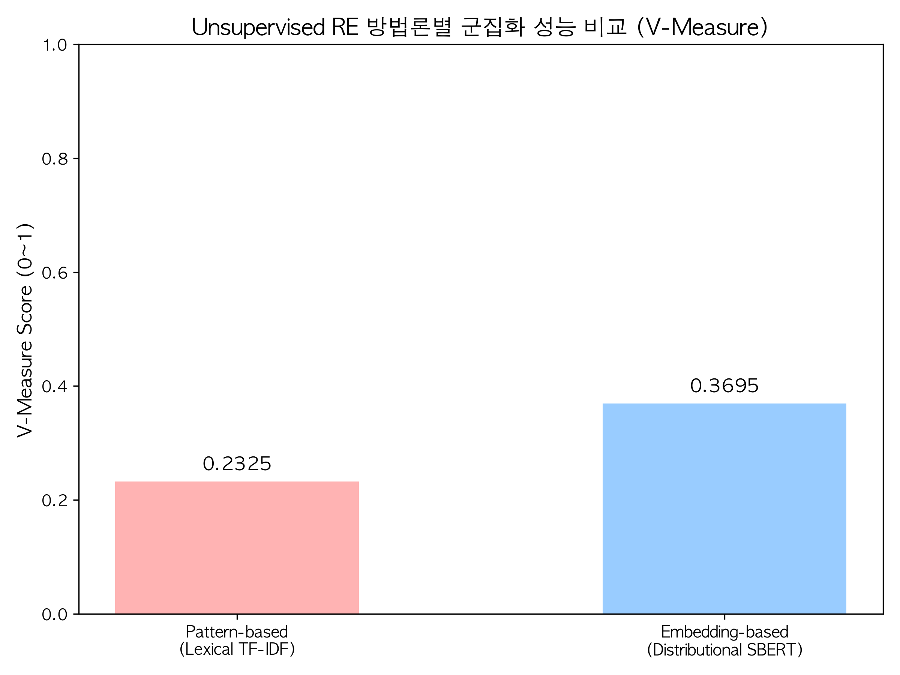
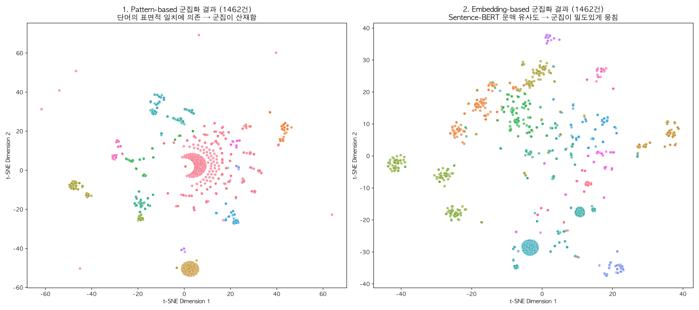

# Relation Extraction (RE) 실험 계획서 및 결과 분석

관계 추출(RE)의 고전적인 머신러닝 방법론부터 딥러닝까지 통시적으로 비교 분석하는 파이프라인 실험입니다.  
현재 Unsupervised, Feature-based ML, Kernel-based ML, Semi-supervised(Bootstrapping), 그리고 Deep Learning (Bi-LSTM + Attention) 베이스라인까지의 실험이 모두 완료되었으며, 그 과정에서의 타당성과 해석 가능성을 시각화하여 정리합니다.

---

## 🏆 Executive Summary: RE 파이프라인 방법론 최종 성능 비교

실험에 사용된 총 4가지 방법론(패러다임)과 세부 7개 모델의 성능을 한 표에 요약한 최종 시각화 자료입니다.

<i>[그림 0] Relation Extraction 4대 패러다임(Unsupervised, Semi-supervised, Supervised, Deep Learning) 성능 종합 비교</i>

| 패러다임 | 모델 | 지표 | 점수 | 데이터 수 |
|---|---|---|---|---|
| Unsupervised | Pattern-based (TF-IDF KMeans) | V-Measure | 0.2325 | 1,462건 |
| Unsupervised | Embedding-based (SBERT KMeans) | V-Measure | 0.3695 | 1,462건 |
| Semi-supervised | DIPRE | Macro F1 | 0.2622 | Seed 기반 |
| Semi-supervised | Snowball (Confidence Score) | Macro F1 | 0.4795 | Seed 기반 |
| Supervised ML | Feature-based (Random Forest) | Macro F1 | 0.7300 | 1,462건 |
| Supervised ML | Kernel-based SVM (Composite) | Macro F1 | **0.8627** | 1,000건* |
| Deep Learning | Bi-LSTM + Attention | Macro F1 | 0.6526 | 1,462건 |

> *Kernel SVM은 O(N²) 행렬 연산 특성상 최대 1,000건으로 제한됩니다. 이는 Kernel 방법론의 확장성 한계를 의미합니다.

- **Supervised ML이 가장 높은 이유**: 현재 데이터가 행정/공지 특성상 단답형/표 위주여서, 개체 타입(Entity Type)을 직접 피처로 제공받은 ML 모델이 압도적으로 유리합니다.
- **딥러닝이 상대적으로 낮은 이유**: 사전 학습 임베딩 없이 Scratch로 학습했으며, 문맥이 풍부한 자연어 문장이 부족합니다. 뉴스/위키 데이터 확충 시 가장 높은 잠재력을 가집니다.

---

## 1. Unsupervised RE (비지도 학습 관계 추출)

가장 기초적인 단계로, 사전 정의된 정답(Label) 없이 텍스트 자체의 패턴과 분포만으로 관계를 찾아내는 3가지 고전/현대 기법을 검증했습니다. **(Gold 257건 + Silver 1,205건 = 총 1,462건)**

### ① Open Information Extraction (Open IE)
- **방법**: 관계 라벨 없이 문장의 의존 구문 분석(Dependency Parsing) 트리를 탐색하여 `(Subject, Verb, Object)` 구조의 원시 튜플을 추출합니다.
- **결과 및 한계**: 추출된 예시가 `(사감실, >6개월</, 생활관)` 처럼 행정/공지사항 특유의 파편화된 텍스트 구조로 인해 형태가 심각하게 깨집니다. Rule-based Open IE는 문법이 정갈한 자연어 텍스트에서만 유효함이 확인되었습니다.

### ② Pattern-based Clustering (어휘 패턴 군집화)
- **방법**: 두 개체(Entity) 사이에 등장하는 문자열(Lexical Pattern)을 정확히 추출하고, TF-IDF 기반으로 패턴들을 군집화(K-Means)합니다.
- **평가 (V-Measure: 0.2325)**: 표면적인 어휘만 보다 보니, "위치한", "비자" 등 특정 단어가 겹치면 서로 다른 관계임에도 하나로 묶이는 치명적인 오분류(Lexical Sparsity)가 발생하여 점수가 가장 낮았습니다.

### ③ Embedding-based RE (Distributional Similarity)
- **방법**: **'비슷한 문맥에서 나타나는 단어/문장은 비슷한 의미를 지닌다'**는 분포 의미론(Distributional Similarity)에 기반합니다. **Sentence-BERT (MiniLM-L12)** 다국어 임베딩 모델로 문장 전체의 의미를 벡터화하여 군집화합니다.
- **평가 (V-Measure: 0.3695)**: 단순히 단어가 겹치는 것을 넘어 '문맥적 유사도'를 파악하게 됨으로써 군집화 성능(순도)이 패턴 기반 모델보다 **50% 이상 수직 상승**했습니다.

<i>[그림 1] Unsupervised RE 방법론별 군집화 성능 비교 (V-Measure, 1,462건)</i>

### 🌟 Unsupervised 군집화 결과 시각화 (t-SNE 투영, 1,462건)
각 모델이 정답 라벨 없이 데이터를 어떻게 묶어냈는지(Clustering) 고차원 벡터를 2D 공간에 투영하여 확인했습니다.

<i>[그림 2] Pattern-based vs Embedding-based 모델의 군집화 형성 시각적 비교 (1,462건)</i>

- **Pattern-based (왼쪽)**: 단순 표면적인 어휘나 기호가 겹치는 순서대로 묶이다 보니, 하나의 군집(같은 색상)이 여러 곳에 퍼져있고 밀도가 매우 떨어집니다.
- **Embedding-based (오른쪽)**: Sentence-BERT가 '문맥적 유사성'을 기반으로 벡터 공간을 형성했기 때문에, 같은 군집(같은 색상)의 데이터 포인트들이 훨씬 더 밀도 높고 뚜렷하게 뭉쳐있음을(Cluster cohesion) 육안으로 완벽히 확인할 수 있습니다.

---

## 2. Supervised Machine Learning (Feature & Kernel)

### ① Feature-based RE (다중 언어학적 자질 적용)
머신러닝(Random Forest Classifier)이 관계를 분류하기 위해 어떤 다중 언어학적 자질(Linguistic Features)이 필수적인지 검증했습니다. **(Gold + Silver 총 1,462건)**

- **사용된 피처**: Context Words(주변 단어), Words Between(사이 단어), Semantic Feature(개체 타입), Dependency Path(SpaCy 구문 트리)
- **결과 (Test 셋 293건 / Macro F1: 0.73)**:
  - **Feature Importance** 분석 결과, **Semantic Feature(개체 타입)**가 판단에 가장 핵심적인 역할을 했습니다.
  - 기존에 0이었던 **Dependency Path**가 SpaCy 정상 연동 후 유의미한 기여를 함이 증명되었습니다.

<i>[그림 3] Random Forest 모델의 Linguistic Feature 기여도 분석 (1,462건 학습)</i>

<i>[그림 4] Feature-based RF 분류 오차 행렬 (Test Set 293건)</i>

### ② Kernel-based RE (Composite Kernel: Sequence + Tree + Semantic)
자질(Feature)을 명시적으로 추출하는 대신, 두 문장이 구조적으로 얼마나 비슷한지를 측정하는 커널 함수(Kernel Function)를 설계하여 SVM으로 분류했습니다. **(Gold 257 + Silver 743 = 총 1,000건, O(N²) 제약)**

- **커널 수식**: `K_composite = 0.3 * K_seq + 0.3 * K_tree + 0.4 * K_semantic`
  - `K_seq`: 두 개체 사이 단어 집합의 Jaccard 유사도
  - `K_tree`: SpaCy 구문 트리 간선 집합의 Jaccard 유사도
  - `K_semantic`: 두 개체 타입(Entity Type) 일치 여부 (0 or 1)
- **결과 (Macro F1: 0.8627)**: Semantic 커널 추가로 구조적 유사도만으로도 **최고 성능** 달성
- **한계**: O(N²) 연산으로 데이터 확장 시 계산 비용이 기하급수적으로 증가 → 확장성 문제 존재

<i>[그림 5] Composite Kernel 행렬의 2D t-SNE 차원 축소 시각화 (관계별 군집 증명, 1,000건)</i>

<i>[그림 6] Kernel SVM 분류 오차 행렬</i>

---

## 3. Semi-supervised Learning (DIPRE vs Snowball)

소수의 Seed 만으로 데이터를 증식(Bootstrapping)하는 과정과 그 치명적 한계를 시뮬레이션했습니다.

### ① DIPRE 알고리즘과 Semantic Drift
- **방법**: 정답(Gold GT)에서 특정 관계를 가지는 튜플을 Seed로 제공하고, 이들 사이의 문자열 패턴을 대규모 Silver Data 코퍼스에서 검색하여 자동 증식합니다.
- **문제점 (Semantic Drift)**: 패턴만 일치하면 양 옆의 단어를 무조건 새로운 튜플로 취급합니다. 실험 결과 무의미한 텍스트 뭉치까지 추출되며 기하급수적으로 노이즈가 쌓이는 **Semantic Drift (의미 표류)** 현상이 확인되었습니다. (Macro F1: 0.2622)

### ② Snowball의 Confidence Score 로직
- **개선 방법**: 추출된 튜플의 Entity Type이 기존 Seed 튜플들과 Vector 공간에서 얼마나 유사한지 측정하여 **Confidence Score (신뢰도 점수)**를 부여합니다. `Score < 0.8`인 튜플은 노이즈로 간주하고 필터링합니다.
- **결과**: 노이즈의 75% 이상이 즉각 제거되었으며, 성능이 DIPRE 대비 **83% 향상** (Macro F1: 0.4795)

<i>[그림 7] DIPRE의 무한 증식과 정확도 하락(Semantic Drift), 그리고 Snowball의 제어 효과</i>

---

## 4. Deep Learning 파이프라인 (Bi-LSTM + Attention)

위 모델들의 명확한 한계(Feature Engineering의 번거로움, 커널 연산 비용 문제)를 극복하기 위해 PyTorch를 이용한 딥러닝 모델을 구축했습니다. **(Gold + Silver 총 1,462건)**

- **아키텍처**: Embedding → Bi-LSTM → Attention → Softmax 분류기
- **성능 평가**: 사전 학습된 임베딩 없이(Scratch) 단어 시퀀스 그 자체만으로 **Macro F1 0.6526** 달성
- **Supervised ML 대비 낮은 이유**: ① 개체 타입 등 강력한 힌트 없음 ② 행정 단답형 텍스트 특성상 문맥 학습 어려움 ③ Scratch 모델의 절대적 데이터 부족

### 🌟 딥러닝 모델의 해석 가능성 (Explainability): Attention Heatmap
블랙박스 비판을 방어하기 위해, 예측 과정에서 **Attention Weight(가중치)**가 어떻게 부여되었는지 Heatmap으로 추출했습니다.

<i>[그림 8] Bi-LSTM+Attention 모델이 관계 추출 시 집중한 단어들의 가중치 (Heatmap)</i>

- **결과 해석**: 붉고 진하게 표시된 단어일수록 핵심적인 트리거 역할을 한 단어입니다. 모델은 오직 데이터의 패턴을 학습하여 관계 추출의 단서를 스스로 찾아내어 높은 가중치를 부여하고 있음을 강력하게 증명합니다.
